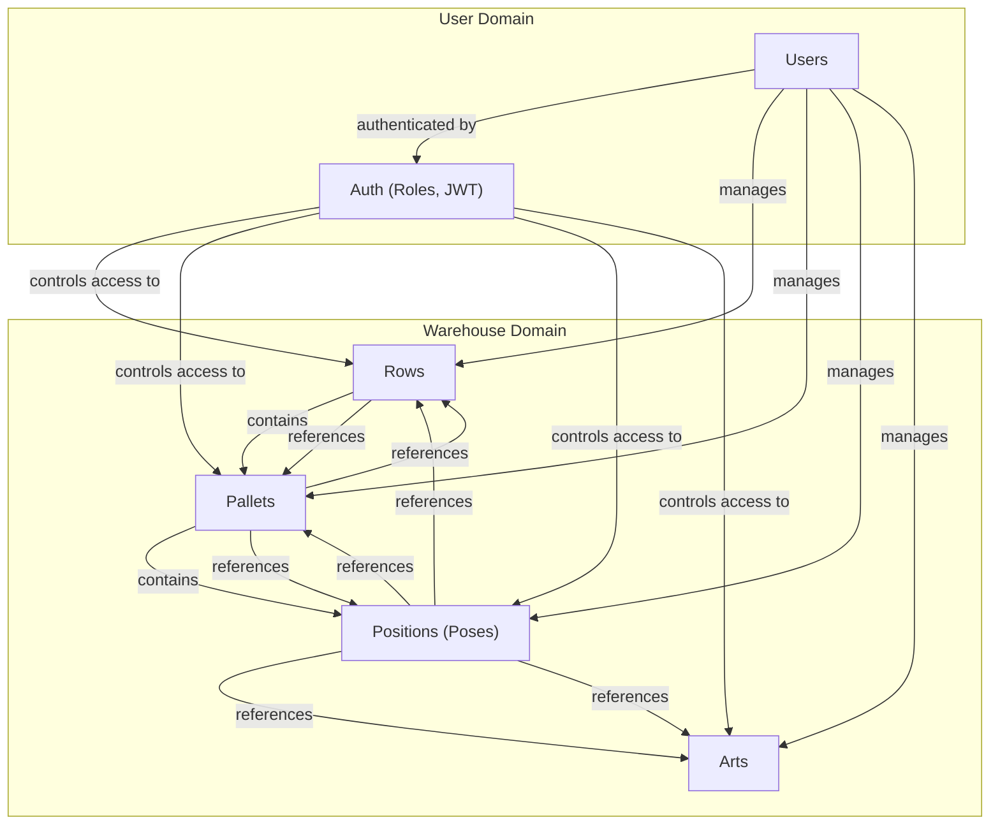

# btw-wh-server: Документация для Frontend

---

## Оглавление

- [Общее описание](#общее-описание)
- [Архитектура и взаимосвязи](#архитектура-и-взаимосвязи)
- [Модули и их API](#модули-и-их-api)
  - [Auth (Аутентификация и пользователи)](#auth-аутентификация-и-пользователи)
  - [Arts (Артикулы)](#arts-артикулы)
  - [Rows (Ряды)](#rows-ряды)
  - [Pallets (Паллеты)](#pallets-паллеты)
  - [Poses (Позиции)](#poses-позиции)
- [Рекомендации по интеграции и построению фронтенда](#рекомендации-по-интеграции-и-построению-фронтенда)
- [Best Practices для UI и работы с API](#best-practices-для-ui-и-работы-с-api)
- [Расширение и поддержка](#расширение-и-поддержка)

---

## Общее описание

btw-wh-server — это backend для системы управления складом. Все данные и бизнес-логика доступны через REST API. Документация предназначена для frontend-разработчиков: здесь описаны все сущности, их связи, форматы запросов/ответов и рекомендации по построению UI.

---

## Архитектура и взаимосвязи



- **Rows** — ряды склада, содержат паллеты.
- **Pallets** — паллеты, принадлежат ряду, содержат позиции.
- **Poses** — позиции (ячейки), принадлежат паллете и ряду, ссылаются на артикула.
- **Arts** — справочник артикулов.
- **Users/Auth** — пользователи, роли, JWT-аутентификация.

---

## Модули и их API

### Auth (Аутентификация и пользователи)

- **Назначение:** Управление пользователями, ролями, аутентификация (JWT).
- **API:**
  - `POST   /api/auth/login` — вход (username, password)
  - `POST   /api/auth/register` — регистрация
  - `GET    /api/auth/users` — список пользователей
  - `GET    /api/auth/users/:id` — пользователь по ID
  - `GET    /api/auth/me/:id` — текущий пользователь (и JWT)
  - `PUT    /api/auth/users/:userId` — обновление пользователя
  - `GET    /api/auth/roles` — список ролей

**Пример запроса:**

```js
fetch("/api/auth/login", {
  method: "POST",
  headers: { "Content-Type": "application/json" },
  body: JSON.stringify({ username: "admin", password: "123456" }),
})
  .then((res) => res.json())
  .then((data) => {
    localStorage.setItem("token", data.token);
    // ...
  });
```

**Особенности:**

- JWT-токен возвращается при логине/регистрации, используйте его для авторизации в последующих запросах (в заголовке Authorization: Bearer ...).
- Пароли не возвращаются в ответах.
- Роли: ADMIN, USER (можно расширять).

---

### Arts (Артикулы)

- **Назначение:** CRUD для справочника артикулов, интеграция с внешним API (btrade).
- **API:**
  - `GET    /api/arts` — список артикулов (пагинация, поиск)
  - `GET    /api/arts/id/:id` — артикул по ID
  - `GET    /api/arts/artikul/:artikul` — артикул по коду
  - `GET    /api/arts/btrade/:artikul` — информация о товаре с внешнего сайта
  - `POST   /api/arts/upsert` — массовое добавление/обновление

**Пример запроса:**

```js
fetch("/api/arts?search=ABC&page=1&limit=10")
  .then((res) => res.json())
  .then((data) => console.log(data.data));
```

**Особенности:**

- В ответах всегда массив объектов Art с полями: artikul, nameukr, namerus, zone, limit, marker, btradeStock, createdAt, updatedAt.
- Для поиска используйте query-параметр search.
- Для массового импорта используйте POST /api/arts/upsert (требует массив объектов Art).

---

### Rows (Ряды)

- **Назначение:** CRUD для рядов склада, каскадное удаление паллет и позиций.
- **API:**
  - `GET    /api/rows` — список рядов
  - `GET    /api/rows/id/:id` — ряд по ID
  - `GET    /api/rows/title/:title` — ряд по названию
  - `POST   /api/rows` — создать ряд
  - `PUT    /api/rows/:id` — обновить ряд
  - `DELETE /api/rows/:id` — удалить ряд (каскадно удаляет паллеты и позиции)

**Пример запроса:**

```js
const rows = await fetch("/api/rows").then((r) => r.json());
```

**Особенности:**

- В ответах массив Row: { \_id, title, pallets, createdAt, updatedAt }
- При удалении ряда удаляются все связанные паллеты и позиции.

---

### Pallets (Паллеты)

- **Назначение:** CRUD для паллет, связь с рядом и позициями, перемещение позиций.
- **API:**
  - `GET    /api/pallets` — список паллет
  - `GET    /api/pallets/:id` — паллета по ID
  - `GET    /api/pallets/by-row/:rowId` — паллеты по ряду
  - `POST   /api/pallets` — создать паллету
  - `PUT    /api/pallets/:id` — обновить паллету
  - `DELETE /api/pallets/:id` — удалить паллету (удаляет позиции)
  - `DELETE /api/pallets/:id/poses` — удалить все позиции паллеты
  - `POST   /api/pallets/move-poses` — переместить позиции между паллетами

**Пример запроса:**

```js
const pallets = await fetch("/api/pallets/by-row/ROW_ID").then((r) => r.json());
```

**Особенности:**

- В ответах массив Pallet: { \_id, title, row, poses, sector, createdAt, updatedAt }
- При удалении паллеты удаляются все связанные позиции.
- Для перемещения позиций используйте POST /api/pallets/move-poses.

---

### Poses (Позиции)

- **Назначение:** CRUD для позиций (ячейки), связь с паллетой, рядом, артикулом.
- **API:**
  - `GET    /api/poses` — список позиций (фильтрация, пагинация)
  - `GET    /api/poses/:id` — позиция по ID
  - `GET    /api/poses/by-pallet/:palletId` — позиции по паллете
  - `GET    /api/poses/by-row/:rowId` — позиции по ряду
  - `POST   /api/poses` — создать позицию
  - `POST   /api/poses/bulk` — массовое создание позиций
  - `PUT    /api/poses/:id` — обновить позицию
  - `DELETE /api/poses/:id` — удалить позицию

**Пример запроса:**

```js
const poses = await fetch("/api/poses?artikul=ABC&page=1&limit=10").then((r) =>
  r.json()
);
```

**Особенности:**

- В ответах массив объектов Pos: { \_id, pallet, row, artikul, quant, boxes, date, sklad, createdAt, updatedAt }
- Для массового создания используйте POST /api/poses/bulk (требует массив объектов Pos).

---

## Рекомендации по интеграции и построению фронтенда

- **Авторизация:**

  - После логина/регистрации сохраняйте JWT-токен (например, в localStorage).
  - Для защищённых запросов добавляйте заголовок `Authorization: Bearer <token>`.
  - Реализуйте автоматическое обновление токена (если появится refresh flow).

- **Работа с данными:**

  - Используйте пагинацию и фильтрацию для списков (arts, poses).
  - Для поиска используйте query-параметры (search, artikul, rowId, palletId и т.д.).
  - Кэшируйте справочники (arts, roles) на клиенте для ускорения UI.
  - Для сложных форм (bulk import) валидируйте данные на клиенте до отправки.

- **Обработка ошибок:**

  - Все ошибки приходят в формате `{ message: string, error?: any }`.
  - Показывайте пользователю понятные сообщения об ошибках.
  - Для 401/403 реализуйте редирект на страницу логина.

- **UI/UX:**

  - Используйте современные UI-фреймворки (например, shadcn/ui, Radix, Tailwind).
  - Для больших таблиц используйте виртуализацию (react-virtualized, TanStack Table).
  - Для форм используйте react-hook-form + zod для валидации.
  - Для асинхронных запросов используйте TanStack React Query (или SWR) для кэширования и автоматического обновления данных.

- **Типы данных:**

  - Определяйте типы для всех сущностей (Art, Row, Pallet, Pos, User) на фронте для автокомплита и типобезопасности.
  - Пример:
    ```ts
    export interface Art {
      _id: string;
      artikul: string;
      nameukr?: string;
      namerus?: string;
      zone: string;
      limit?: number;
      marker?: string;
      btradeStock?: { value: number; date: string };
      createdAt?: string;
      updatedAt?: string;
    }
    // Аналогично для Row, Pallet, Pos, User
    ```

- **Сценарии использования:**
  - **Дашборд:** Получение агрегированных данных по рядам, паллетам, позициям.
  - **Поиск и фильтрация:** Быстрый поиск по артикулам, позициям, паллетам.
  - **Массовый импорт:** Используйте bulk endpoints для загрузки больших объёмов данных.
  - **Редактирование:** Для редактирования сущностей используйте PUT/POST, после успешного ответа обновляйте локальный кэш.

---

## Best Practices для UI и работы с API

- Используйте TanStack React Query для всех запросов (кэш, refetch, optimistic updates).
- Для форм — react-hook-form + zod.
- Для таблиц — TanStack Table, react-virtualized.
- Для уведомлений об ошибках — react-toastify или аналог.
- Для авторизации — храните токен в httpOnly cookie или localStorage (с учётом безопасности).
- Для адаптивности — Tailwind CSS, mobile-first дизайн.
- Для оптимизации изображений — используйте webp, lazy loading.
- Для глобального состояния — Zustand или Context API (если нужно).
- Для типизации — используйте TypeScript, автогенерацию типов по OpenAPI/Swagger (если появится).

---

## Расширение и поддержка

- Для добавления новых сущностей или сценариев работы — следуйте REST-подходу, используйте существующие паттерны.
- Для интеграции с новым UI — используйте предоставленные примеры запросов и схемы данных.
- Для вопросов и поддержки — обращайтесь к backend-разработчикам.

---

**Документация актуальна на момент последнего коммита. Для деталей — смотрите исходный код модулей и их README.**
