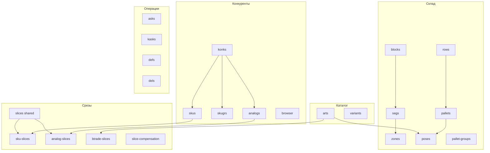

# btw-wh-server

Backend системы управления складом и мониторинга конкурентов.

**Стек:** Node.js, Express 5, TypeScript, MongoDB/Mongoose, Vitest.

---

## Быстрый старт

```bash
npm install
npm run dev          # hot reload, src/index.ts, порт 3232
npm run build        # компиляция → dist/
npm run test:run     # Vitest + MongoDB Memory Server
npm run test:coverage
```

- **Точка входа:** [`src/index.ts`](src/index.ts) — регистрация `/api/*` роутов и запуск `startCronOperations()`.
- **Переменные окружения:** `.env` (MongoDB, JWT, Telegram и др.).

---

## Карта репозитория

| Путь | Назначение |
|------|------------|
| [`src/modules/`](src/modules/) | Доменные модули (основной код) |
| [`src/cron/`](src/cron/) | Оркестрация cron + аналитические отчёты |
| [`src/middleware/`](src/middleware/) | Auth, roles, ownership |
| [`src/utils/`](src/utils/) | Глобальные утилиты (asyncHandler, telegram, dates) |
| [`src/lib/`](src/lib/) | Shared-библиотеки (Excel) |
| [`src/constants/`](src/constants/) | Роли, Telegram-константы |
| [`src/test/`](src/test/) | Setup тестов, хелперы |
| [`docs/api/`](docs/api/) | REST API по модулям |
| [`docs/modules/`](docs/modules/) | Концепции, сущности, связи |
| [`.cursor/rules/project.mdc`](.cursor/rules/project.mdc) | Архитектурное лекало для разработки |

---

## Смысловые домены


```mermaid
flowchart TB
  subgraph warehouse [Склад]
    blocks --> segs --> zones
    rows --> pallets --> poses
    palletGroups[pallet-groups]
  end

  subgraph catalog [Каталог]
    arts
    variants
  end

  subgraph competitors [Конкуренты]
    konks --> skus
    konks --> skugrs
    konks --> analogs
    browser
  end

  subgraph analytics [Срезы]
    skuSlices[sku-slices]
    analogSlices[analog-slices]
    btradeSlices[btrade-slices]
    sharedSlices[slices shared]
    sliceComp[slice-compensation]
  end

  subgraph ops [Операции]
    asks
    kasks
    defs
    dels
  end

  arts --> poses
  skus --> skuSlices
  analogs --> analogSlices
  arts --> btradeSlices
  sharedSlices --> skuSlices
  sharedSlices --> analogSlices
```

### Склад и размещение

Иерархия: `Block → Seg → Zone`. Паллеты и позиции — физическое размещение товара на складе.

| Модуль | Код | API | Документация |
|--------|-----|-----|--------------|
| blocks | [`src/modules/blocks/`](src/modules/blocks/) | `/api/blocks` | [API](docs/api/blocks.md) · [концепция](docs/modules/blocks.md) |
| segs | [`src/modules/segs/`](src/modules/segs/) | `/api/segs` | [API](docs/api/segs.md) · [концепция](docs/modules/segs.md) |
| zones | [`src/modules/zones/`](src/modules/zones/) | `/api/zones` | [API](docs/api/zones.md) · [концепция](docs/modules/zones.md) |
| rows | [`src/modules/rows/`](src/modules/rows/) | `/api/rows` | [API](docs/api/rows.md) · [концепция](docs/modules/rows.md) |
| pallets | [`src/modules/pallets/`](src/modules/pallets/) | `/api/pallets` | [API](docs/api/pallets.md) · [концепция](docs/modules/pallets.md) |
| pallet-groups | [`src/modules/pallet-groups/`](src/modules/pallet-groups/) | `/api/pallet-groups` | [API](docs/api/pallet-groups.md) · [концепция](docs/modules/pallet-groups.md) |
| poses | [`src/modules/poses/`](src/modules/poses/) | `/api/poses` | [API](docs/api/poses.md) · [концепция](docs/modules/poses.md) |

### Операции и заявки

| Модуль | Код | API | Документация |
|--------|-----|-----|--------------|
| asks | [`src/modules/asks/`](src/modules/asks/) | `/api/asks` | [API](docs/api/asks.md) · [концепция](docs/modules/asks.md) |
| kasks | [`src/modules/kasks/`](src/modules/kasks/) | `/api/kasks` | [API](docs/api/kasks.md) · [концепция](docs/modules/kasks.md) |
| defs | [`src/modules/defs/`](src/modules/defs/) | `/api/defs` | [API](docs/api/defs.md) · [концепция](docs/modules/defs.md) |
| dels | [`src/modules/dels/`](src/modules/dels/) | `/api/dels` | [API](docs/api/dels.md) · [концепция](docs/modules/dels.md) |

### Собственный каталог

| Модуль | Код | API | Документация |
|--------|-----|-----|--------------|
| arts | [`src/modules/arts/`](src/modules/arts/) | `/api/arts` | [API](docs/api/arts.md) · [концепция](docs/modules/arts.md) |
| variants | [`src/modules/variants/`](src/modules/variants/) | `/api/variants` | [API](docs/api/variants.md) · [концепция](docs/modules/variants.md) |

### Конкуренты и парсинг

| Модуль | Код | API | Документация |
|--------|-----|-----|--------------|
| konks | [`src/modules/konks/`](src/modules/konks/) | `/api/konks` | [API](docs/api/konks.md) · [концепция](docs/modules/konks.md) |
| prods | [`src/modules/prods/`](src/modules/prods/) | `/api/prods` | [API](docs/api/prods.md) · [концепция](docs/modules/prods.md) |
| skus | [`src/modules/skus/`](src/modules/skus/) | `/api/skus` | [API](docs/api/skus.md) · [концепция](docs/modules/skus.md) |
| skugrs | [`src/modules/skugrs/`](src/modules/skugrs/) | `/api/skugrs` | [API](docs/api/skugrs.md) · [концепция](docs/modules/skugrs.md) |
| analogs | [`src/modules/analogs/`](src/modules/analogs/) | `/api/analogs` | [API](docs/api/analogs.md) · [концепция](docs/modules/analogs.md) |
| browser | [`src/modules/browser/`](src/modules/browser/) | `/api/browser` | [API](docs/api/browser.md) · [концепция](docs/modules/browser.md) |

**Browser** — live-парсинг остатков и цен по URL страницы товара. Организация по конкурентам:

| Конкурент | Путь |
|-----------|------|
| air | [`src/modules/browser/air/`](src/modules/browser/air/) |
| balun | [`src/modules/browser/balun/`](src/modules/browser/balun/) |
| perfect | [`src/modules/browser/perfect/`](src/modules/browser/perfect/) |
| sharik | [`src/modules/browser/sharik/`](src/modules/browser/sharik/) |
| sharte | [`src/modules/browser/sharte/`](src/modules/browser/sharte/) |
| yumi | [`src/modules/browser/yumi/`](src/modules/browser/yumi/) |
| yumin | [`src/modules/browser/yumin/`](src/modules/browser/yumin/) |
| общие утилиты | [`src/modules/browser/utils/`](src/modules/browser/utils/) |
| group-pages | [`src/modules/browser/group-pages/`](src/modules/browser/group-pages/) |
| group-products | [`src/modules/browser/group-products/`](src/modules/browser/group-products/) |

### Срезы и аналитика

| Модуль | Код | API | Документация |
|--------|-----|-----|--------------|
| sku-slices | [`src/modules/sku-slices/`](src/modules/sku-slices/) | `/api/sku-slices` | [API](docs/api/sku-slices.md) · [концепция](docs/modules/sku-slices.md) |
| analog-slices | [`src/modules/analog-slices/`](src/modules/analog-slices/) | `/api/analog-slices` | [API](docs/api/analog-slices.md) · [концепция](docs/modules/analog-slices.md) |
| btrade-slices | [`src/modules/btrade-slices/`](src/modules/btrade-slices/) | `/api/btrade-slices` | [API](docs/api/btrade-slices.md) · [концепция](docs/modules/btrade-slices.md) |
| slices | [`src/modules/slices/`](src/modules/slices/) | — | [концепция](docs/modules/slices.md) — shared-утилиты (без HTTP) |
| slice-compensation | [`src/modules/slice-compensation/`](src/modules/slice-compensation/) | — | [концепция](docs/modules/slice-compensation.md) — cron-only |

### Система

| Модуль | Код | API | Документация |
|--------|-----|-----|--------------|
| auth | [`src/modules/auth/`](src/modules/auth/) | `/api/auth` | [API](docs/api/auth.md) · [концепция](docs/modules/auth.md) |
| constants | [`src/modules/constants/`](src/modules/constants/) | `/api/constants` | [API](docs/api/constants.md) · [концепция](docs/modules/constants.md) |

`constants` — эталон стандартного HTTP-модуля (см. [project.mdc](.cursor/rules/project.mdc)).

---

## Cross-cutting слои

### Cron

[`src/cron/startCronOperations.ts`](src/cron/startCronOperations.ts) запускает фоновые задачи из модулей:

- `defs` — расчёт дефицитов
- `analog-slices`, `btrade-slices`, `sku-slices` — ежедневные срезы
- `slice-compensation` — компенсирующие срезы
- `skugrs`, `skus` — заполнение групп и флаги invalid
- `src/cron/startFillPosNameukrFromArtsCron.ts` — синхронизация названий позиций

Telegram-отчёты: [`src/cron/analytics-notifications/`](src/cron/analytics-notifications/).

### Middleware

[`src/middleware/README.md`](src/middleware/README.md) — `checkAuth`, `checkRoles`, `checkOwnership`.

### Типы модулей

Краткая выжимка из [`.cursor/rules/project.mdc`](.cursor/rules/project.mdc):

| Тип | Пример | Структура |
|-----|--------|-----------|
| Стандартный HTTP | `constants` | `router.ts` → `controllers/` → `models/` |
| Reporting | `sku-slices`, `analog-slices` | + `controllers/common/`, Excel-утилиты |
| Cron-only | `slice-compensation` | только `cron/` + `utils/` |
| Shared domain | `slices` | только `config/` + `utils/` |
| Browser/scraper | `browser` | по конкуренту + общие `utils/` |

Слои внутри endpoint: `router → controller → util → model`.

### Утилиты и библиотеки

| Путь | Содержимое |
|------|------------|
| [`src/utils/`](src/utils/) | `asyncHandler`, форматирование дат, Telegram, sliceDate |
| [`src/lib/excel/`](src/lib/excel/) | Стили и форматирование Excel-отчётов |
| [`src/constants/`](src/constants/) | `roles.ts`, `telegram.ts` |

### Тесты

- Документация: [`src/test/README.md`](src/test/README.md)
- Setup: [`src/test/setup.ts`](src/test/setup.ts), хелперы: [`src/test/utils/testHelpers.ts`](src/test/utils/testHelpers.ts)
- Co-located тесты: `__tests__/` рядом с кодом
- Порог coverage для `src/modules/**`: **80%** lines/functions/statements, **70%** branches ([`vitest.config.ts`](vitest.config.ts))

```bash
npm run test:run -- src/modules/<module>
```

---

## Куда идти дальше

| Тема | Ссылка |
|------|--------|
| API целиком | [`docs/api/index.md`](docs/api/index.md) |
| Матрица доступа по ролям | [`docs/api/access-matrix.md`](docs/api/access-matrix.md) |
| Концепции модулей | [`docs/modules/`](docs/modules/) |
| Правила разработки | [`.cursor/rules/project.mdc`](.cursor/rules/project.mdc) |
| Middleware | [`src/middleware/README.md`](src/middleware/README.md) |
| Тестирование | [`src/test/README.md`](src/test/README.md) |
